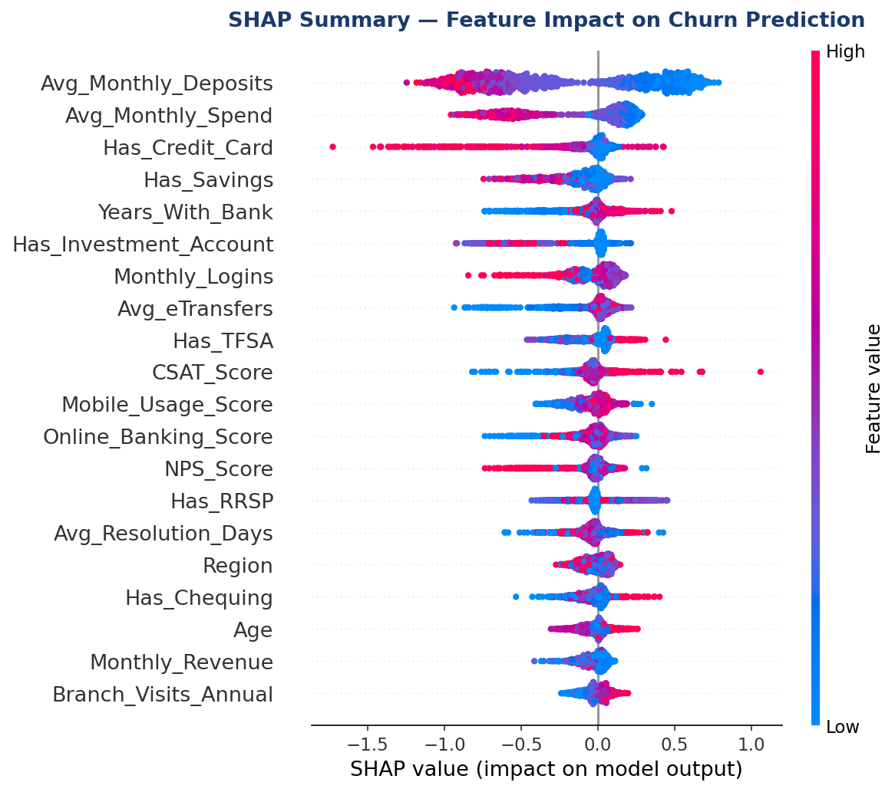
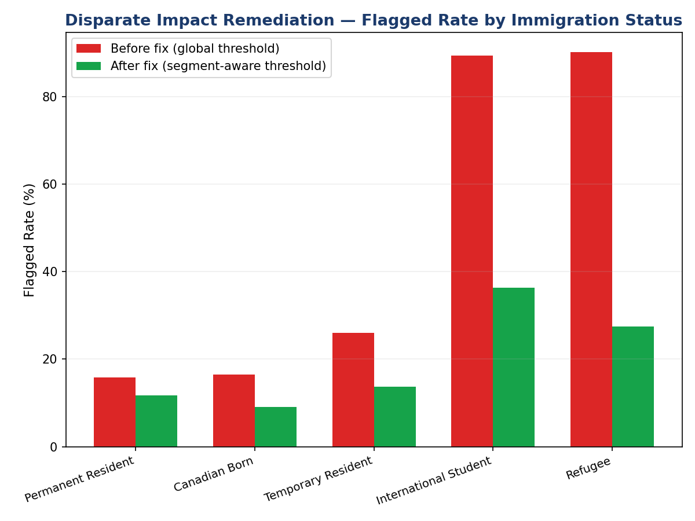
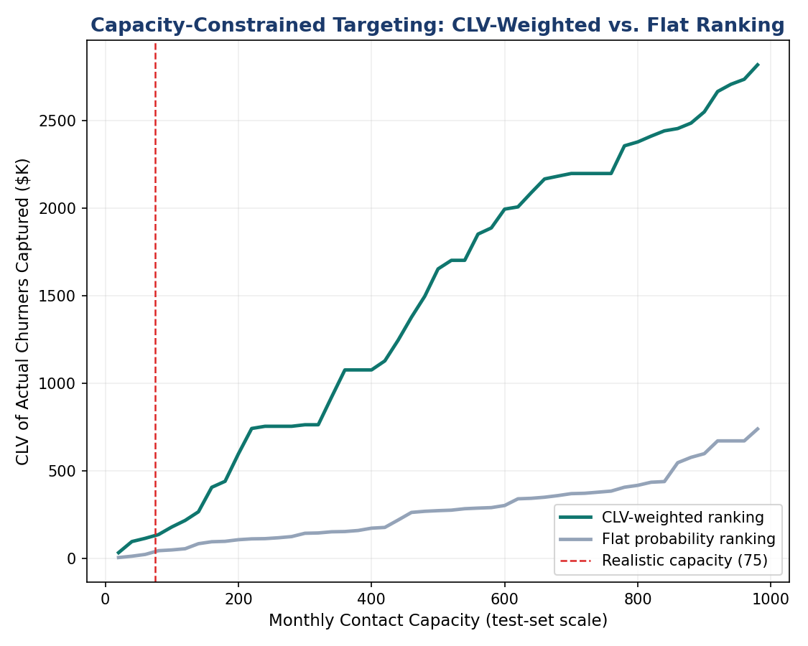
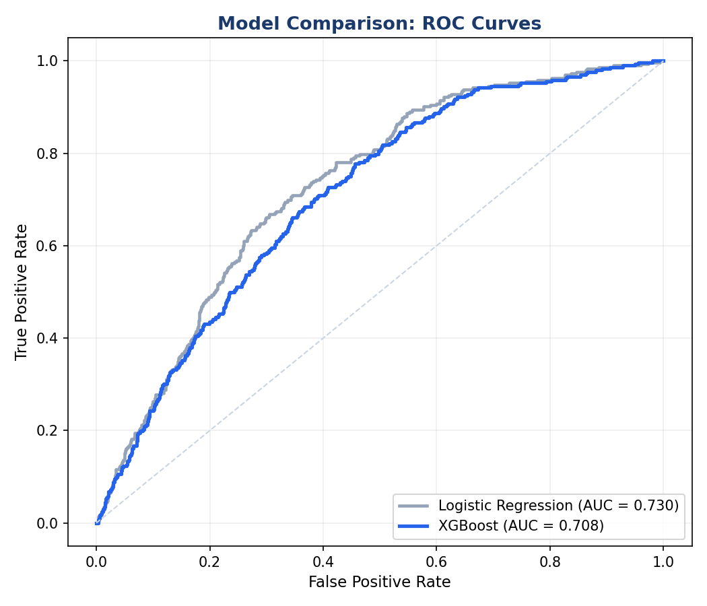

# NorthBridge Bank — Retail Banking Churn Analytics

**Simulated consulting engagement** | Greater Toronto Area market | 10,000 customers | FY2025

A full-stack data analytics project simulating a senior data analyst role on a retail banking
churn reduction engagement. Built across seven phases — from market assessment through predictive
modeling, SHAP explainability, model risk review, and remediation — using Python, SQL, XGBoost,
and Power BI.

---

## The Business Problem

A mid-sized Canadian retail bank is losing customers to Big Five banks and digital-first
challengers (Wealthsimple, Tangerine, Neo Financial) in the Greater Toronto Area. Churn is
concentrated among digitally active customers with shallow product relationships — and the bank
needs to know which customers are at risk, why, and how to target retention spending effectively.

---

## What This Project Demonstrates

| Skill Area | Specifics |
|---|---|
| **Python** | pandas, numpy, scikit-learn, XGBoost, SHAP, matplotlib |
| **SQL** | Production-style ANSI queries: churn analysis, CLV, product penetration, retention targets |
| **Machine Learning** | XGBoost churn classifier + logistic regression baseline; AUC comparison; threshold optimization |
| **Model Explainability** | SHAP global summary, per-customer waterfall explanations |
| **Model Risk** | Fairness audit (disparate impact), calibration analysis (Brier score), cost-sensitive thresholding |
| **Power BI** | Star schema data model, 30+ DAX measures, interactive executive dashboard |
| **Analytics** | CLV modeling, product penetration analysis, 5-year value-at-risk quantification |
| **Communication** | Five formal Word reports, a 16-slide strategy deck, an interactive HTML dashboard |

---

## Key Results

> **Students churn at 26.8% and Newcomers at 21.8%** — 8 to 20 times higher than Families (2.7%)
> and Affluent customers (1.4%).

> **$14.6M in 5-year CLV** is at risk from churned customers. Young Professionals ($5.7M)
> and Families ($5.0M) account for 73% of that exposure.

> **Logistic regression outperformed XGBoost** on AUC (0.730 vs 0.708) — an honest result
> reported plainly, reflecting the dataset's largely linear churn signal.

> **Isotonic calibration reduced the Brier score by 54%** (0.212 → 0.097), correcting
> systematic overconfidence in the raw model predictions.

> **CLV-weighted targeting captures 165.8% more recoverable value** per contact than a flat
> probability-ranked list at the same monthly capacity.

> **A 5.7x disparate impact** in model flagging rates across immigration status groups was
> identified, partially remediated to 3.97x, and documented with explicit governance
> recommendations rather than papered over.

---

## Project Structure

```
northbridge-bank-analytics/
│
├── notebooks/
│   └── northbridge_analytics.ipynb   ← Start here — full walkthrough
│
├── sql/
│   └── phase4_analytics_queries.sql  ← 25 production-ready queries
│
├── powerbi/
│   ├── dax_measures_library.txt      ← 30+ DAX measures
│   ├── dim_customer.csv              ← Star schema exports
│   ├── fact_product_holdings.csv
│   ├── fact_transactions.csv
│   └── dim_date.csv
│
├── dashboard/
│   └── NorthBridge_Executive_Dashboard.html  ← Open in browser, no install
│
├── reports/
│   ├── NorthBridge_Phase3_Analytics_Report.docx
│   ├── NorthBridge_Phase4_Strategy_Deck.pptx  ← 16-slide executive deck
│   ├── NorthBridge_Phase5_Model_Card.docx
│   ├── NorthBridge_Phase6_Model_Risk_Review.docx
│   └── NorthBridge_Phase7_Model_Remediation.docx
│
├── data/
│   └── retention_priority_list.csv   ← CLV-weighted contact list output
│
└── images/                           ← Key visualizations
```

---

## Phase Summary

### Phase 1 — Market Assessment
Toronto market sizing, competitor landscape (RBC, TD, Scotiabank, BMO, CIBC, Wealthsimple,
Tangerine, Neo Financial), five strategic customer segments defined, and formal problem statement
established.

### Phase 2 — Synthetic Dataset
10,000-customer synthetic dataset across six tables (customer master, product holdings,
transactions, digital engagement, branch interactions, satisfaction), calibrated to Toronto CMA
demographic signals from Statistics Canada's 2021 Census and Canadian Payments data. Overall
churn rate: 11.68%.

### Phase 3 — Customer Analytics
Quantitative analysis of churn by segment, region, and tenure; 5-year CLV model by segment;
product penetration gap analysis; rule-based churn risk scoring. Full findings in
[Phase 3 Report](reports/NorthBridge_Phase3_Analytics_Report.docx).

### Phase 4 — Predictive Model, SQL Layer & Dashboard
- XGBoost churn classifier (AUC 0.708)
- 25 production-ready SQL queries covering churn, CLV, product penetration, retention targeting
- Power BI star schema + 30+ DAX measures
- [Interactive HTML executive dashboard](dashboard/NorthBridge_Executive_Dashboard.html)
- [16-slide strategy deck](reports/NorthBridge_Phase4_Strategy_Deck.pptx)

### Phase 5 — Model Explainability & Validation
Logistic regression baseline trained on identical features — it outperformed XGBoost (AUC 0.730
vs 0.708). SHAP applied to XGBoost: global beeswarm summary and per-customer waterfall
explanations. Monthly deposit behavior is the single strongest churn signal. Formal model card
documented. Full findings in [Phase 5 Model Card](reports/NorthBridge_Phase5_Model_Card.docx).

### Phase 6 — Model Risk Review
Stressed the model rather than taking outputs at face value:
- **Fairness**: 5.7x disparate flagging rate by immigration status (International Students 89%
  vs Canadian Born 16%) — well beyond what the 3.4x actual churn-rate gap justifies
- **Calibration**: both models systematically overconfident — a 70% predicted churn score maps
  to a ~22% actual churn rate
- **Threshold design**: naive cost-minimization recommends flagging ~79% of customers, which is
  operationally unworkable

Full audit in [Phase 6 Model Risk Review](reports/NorthBridge_Phase6_Model_Risk_Review.docx).

### Phase 7 — Remediation & Deployment Readiness
Implemented a fix for each Phase 6 defect, re-measured results against the same test set:

| Defect | Fix | Result |
|---|---|---|
| Overconfidence | Isotonic calibration (held-out) | Brier 0.212 → 0.097 (54% improvement) |
| 5.7x disparate impact | Segment-aware thresholds | Ratio reduced to 3.97x |
| 79% flagging rate | CLV-weighted capacity-constrained ranking | 165.8% more value per contact |

**Deployment recommendation**: conditional launch for Family, Affluent, and Young Professional
segments; Student and Newcomer segments held in manual review pending fairness-constrained
retraining.

Full remediation in [Phase 7 Remediation Report](reports/NorthBridge_Phase7_Model_Remediation.docx).

---

## Visual Highlights

**SHAP Summary — Global Feature Impact**



*Low monthly deposits (blue) push strongly toward churn. The model's top drivers are
behavioral — cash flow patterns — not demographics.*

---

**Fairness Remediation — Before vs. After**



*Disparate impact ratio reduced from 5.70x to 3.97x using segment-aware thresholds.
Gap is real progress, not a full solution — documented honestly.*

---

**Capacity-Constrained Targeting**



*CLV-weighted ranking captures significantly more recoverable value per contact than
flat probability ranking at every capacity level.*

---

**Model Comparison: ROC Curves**



*Logistic regression outperforms XGBoost across nearly the entire curve — an honest
finding reported plainly, not buried.*

---

## How to Run

```bash
# 1. Install dependencies
pip install pandas numpy scikit-learn xgboost shap matplotlib

# 2. Generate the synthetic dataset
python generate_dataset.py

# 3. Open the notebook
jupyter notebook notebooks/northbridge_analytics.ipynb
```

The notebook runs end-to-end and reproduces all key outputs.
The SQL queries run on PostgreSQL, Snowflake, or SQL Server without modification.
The HTML dashboard opens in any browser — no installation required.

---

## Limitations

- All customer data is **fully synthetic**. No real bank data was used.
- Demographic distributions were calibrated to public Statistics Canada data but individual
  records are simulated.
- Churn was generated by a rule-based process designed for analytical explainability, not
  measured from a real institution. Real-world model performance will differ.
- The fairness gap was partially but not fully remediated — see Phase 7 for the explicit
  governance recommendation.

---

## Tools & Stack

Python 3.10 · pandas · numpy · scikit-learn 1.8 · XGBoost · SHAP · matplotlib ·
SQL (ANSI/PostgreSQL) · Power BI · DAX · Microsoft Word · PowerPoint

---

*Built as a portfolio project targeting Data Analyst, Business Analyst, and Risk Analyst roles
in the Greater Toronto Area financial services sector.*
